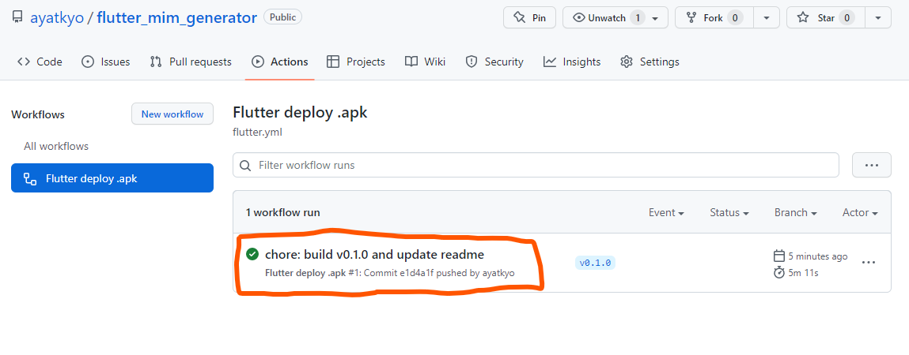
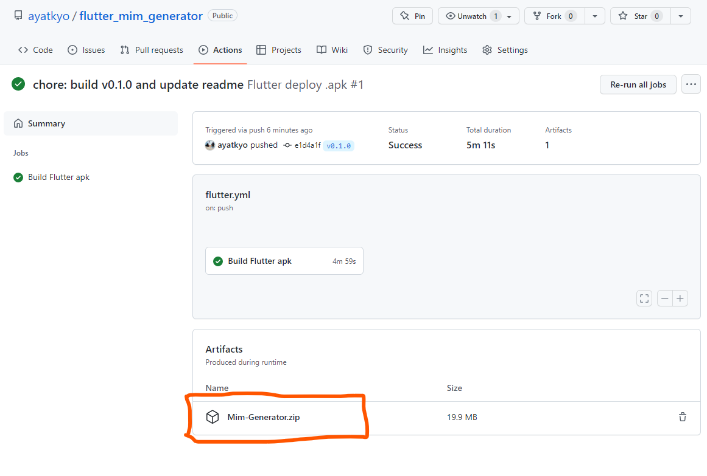

# mim_generator (Coding Test Algostudio)

Flutter Developer Speciality Test

## Daftar Isi

- [Screenshot](#screenshot)
- [Download APK](#download-apk)

## Screenshot

 &nbsp;
 &nbsp;
 &nbsp;
 &nbsp;
 

## Download APK

Untuk download .apk silakan cek [disini](https://github.com/ayatkyo/flutter_mim_generator/actions/workflows/flutter.yml).

**Klik workflow terbaru yang berwarna hijau**

**Scroll ke bagian bawah, dan klik pada Mim-Generator.zip**

